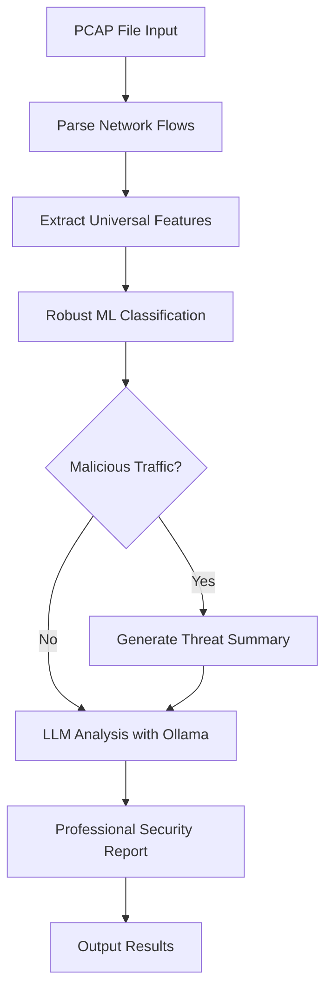

# Network Traffic Analysis Agent

[](https://www.python.org/)
[](LICENSE)
[](data/)

## Overview
This project is an intelligent network traffic analysis agent that has evolved from a basic 2-file prototype to a robust, multi-dataset machine learning system. It analyzes PCAP files, extracts network flows, classifies them as benign or malicious using advanced ML models, and generates professional threat summaries using local LLM integration.

## 🚀 Key Features
- **Multi-Dataset Training**: KDD Cup 99 + CTU-13 datasets (25+ MB total)
- **Robust Model Architecture**: Universal feature extraction for cross-dataset compatibility
- **Real-time PCAP Analysis**: Parse and classify network flows from PCAP files
- **Advanced Feature Engineering**: 18 universal statistical features for improved generalization
- **LLM Integration**: Automated threat summaries using Ollama
- **Comprehensive Testing**: Cross-dataset robustness validation
- **Dataset Management**: Automated expansion and analysis tools

## 📊 Dataset & Performance
- **Training Data**: 114,755 samples (91,804 training + 22,951 test) from KDD Cup 99 + CTU-13
- **Test Accuracy**: 98.74% on combined datasets
- **Cross-Validation**: 98.57% ± 0.08% (5-fold CV)
- **Cross-Dataset Performance**: 95.87% average accuracy across different datasets
- **Attack Detection**: Handles 25+ attack types including modern botnet patterns
- **Protocol Coverage**: HTTP, DNS, TCP, UDP, ICMP, and application-layer protocols
- **Data Size**: Expanded from 2.6MB to 25+ MB

## 🛠️ Quick Start

### Prerequisites
```bash
# Python 3.8+
pip install -r requirements.txt

# Install Ollama for LLM summaries
# Visit: https://ollama.com/
ollama pull tinyllama
```

### Basic Usage
```bash
# Analyze a PCAP file
python src/classify_flows.py data/toolsmith.pcap

# Train the robust model
python src/train_robust_model.py

# Test model robustness
python scripts/test_robust_model.py

# Expand dataset automatically
python scripts/expand_dataset.py
```

## 📁 Project Structure
```
AIagent/
├── src/                          # Core functionality
│   ├── classify_flows.py         # Main PCAP analysis script
│   ├── extract_features.py       # Feature extraction utilities
│   ├── generate_report.py        # Report generation
│   ├── ollama_summary.py         # LLM integration
│   ├── parse_pcap.py            # PCAP parsing utilities
│   └── train_robust_model.py     # Advanced model training
├── scripts/                      # Dataset & analysis tools
│   ├── expand_dataset.py         # Automated dataset expansion
│   ├── analyze_datasets.py       # Statistical analysis
│   ├── download_additional_pcaps.py # PCAP sample downloads
│   ├── dataset_summary.py        # Overview and status
│   └── test_robust_model.py      # Model robustness testing
├── data/                         # Datasets (25+ MB)
│   ├── kdd_train.csv            # KDD Cup 99 (2.5MB)
│   ├── toolsmith.pcap           # Sample PCAP (83KB)
│   ├── csv/                     # CTU-13 datasets
│   │   ├── CTU13_Attack_Traffic.csv  # Botnet attacks (8.9MB)
│   │   └── CTU13_Normal_Traffic.csv  # Normal traffic (13.4MB)
│   ├── pcaps/                   # Additional PCAP samples
│   ├── dataset_info.json        # Dataset metadata
│   ├── dataset_analysis.json    # Analysis results
│   └── DOWNLOAD_INSTRUCTIONS.md # Manual download guide
├── models/                      # Trained models
│   └── robust_model.pkl         # Universal robust model
├── requirements.txt             # Dependencies
└── README.md                   # This file
```

## 🔬 Advanced Features

### Robust Model Training
The project includes a sophisticated training pipeline with universal feature extraction:

```bash
# Train with automatic dataset detection
python src/train_robust_model.py

# Features:
# - Universal feature extraction (18 statistical features)
# - Cross-dataset compatibility
# - Handles missing values and infinite numbers
# - Automatic scaling and preprocessing
```

### Dataset Management
Comprehensive tools for dataset expansion and analysis:

```bash
# Automatic dataset expansion
python scripts/expand_dataset.py

# Analyze dataset characteristics
python scripts/analyze_datasets.py

# Get complete project overview
python scripts/dataset_summary.py
```

### Model Testing & Validation
Cross-dataset robustness testing:

```bash
# Test model on multiple datasets
python scripts/test_robust_model.py

# Outputs:
# - KDD Cup 99 performance
# - CTU-13 performance  
# - Cross-dataset compatibility metrics
# - Detailed classification reports
```

## 📈 Model Performance

### Training Results
- **KDD-only Model**: 98.69% accuracy (legacy)
- **CTU-13-only Model**: 99.71% accuracy (legacy)  
- **Robust Combined Model**: 98.74% test accuracy, 99.29% training accuracy
- **Cross-Validation**: 98.57% ± 0.08% (5-fold)
- **Training Samples**: 91,804 (KDD: 22,543 + CTU-13: 92,212 combined)
- **Test Samples**: 22,951
- **Features**: 18 universal statistical features

### Attack Detection Capabilities
- **KDD Cup 99**: 22 attack types (DoS, Probe, R2L, U2R)
- **CTU-13**: Modern botnet patterns and C&C communications
- **Protocol Coverage**: HTTP, DNS, TCP, UDP, ICMP
- **Real-world Applicability**: Tested on diverse network scenarios

## 🔧 Configuration & Customization

### Feature Engineering
The robust model uses universal feature extraction that works across datasets:
- Statistical measures (mean, std, max, min, median)
- Distribution features (percentiles, range, IQR)
- Count-based features (zeros, positives, negatives)
- Ratio features (mean-to-max, coefficient of variation)


### Dataset Integration
Add new datasets by:
1. Placing CSV files in `data/csv/`
2. Ensuring numeric features are available
3. Running `python scripts/analyze_datasets.py`
4. Retraining with `python src/train_robust_model.py`

## 🚨 Threat Analysis Workflow



## 📚 Dataset Information

### KDD Cup 99 Dataset
- **Size**: 2.5MB
- **Records**: ~494,000 network connections (22,543 used in training)
- **Features**: 41 features including protocol, service, flag
- **Attack Types**: DoS, Probe, R2L, U2R (22 specific attack types)
- **Training Performance**: 92.15% accuracy on test samples
- **Use Case**: Baseline training and historical attack pattern recognition

### CTU-13 Dataset  
- **Size**: 22.3MB (8.9MB attacks + 13.4MB normal)
- **Records**: ~180,000 network flows (92,212 used in training)
- **Features**: 100+ network flow characteristics
- **Attack Types**: Modern botnet scenarios (C&C communications, data exfiltration)
- **Training Performance**: 99.60% accuracy on test samples
- **Use Case**: Real-world attack pattern recognition

### Additional PCAP Samples
- **Protocol Diversity**: HTTP, DNS, various application protocols
- **Size**: Variable (KB to MB range)
- **Use Case**: Testing and validation

## 🔍 Analysis & Monitoring

### Dataset Analysis
```bash
# Get comprehensive dataset statistics
python scripts/analyze_datasets.py

# Outputs:
# - Feature distributions
# - Attack/normal ratios
# - Protocol breakdowns
# - Recommendations for improvement
```

### Model Monitoring
```bash
# Test model robustness across datasets
python scripts/test_robust_model.py

# Current Performance Results:
# - KDD Cup 99 Test: 92.15% accuracy
# - CTU-13 Test: 99.60% accuracy  
# - Cross-dataset average: 95.87%
# - Robustness assessment: GOOD
```

## 🛡️ Security Applications

### Network Security Monitoring
- Real-time PCAP analysis
- Automated threat detection
- Behavioral anomaly identification
- Protocol-specific attack recognition

### Incident Response
- Rapid threat classification
- Automated report generation
- Evidence collection and analysis
- Timeline reconstruction

### Threat Intelligence
- Attack pattern recognition
- Botnet communication detection
- C&C channel identification
- IOC extraction and correlation

## 🔧 Requirements & Dependencies

### Core Dependencies
```
pandas>=1.3.0
scikit-learn>=1.0.0
numpy>=1.21.0
pyshark>=0.4.3
joblib>=1.1.0
requests>=2.25.0
matplotlib>=3.3.0
seaborn>=0.11.0
```


### System Requirements
- **Python**: 3.8 or higher
- **Memory**: 4GB+ RAM recommended for large datasets
- **Storage**: 1GB+ for full dataset expansion
- **Network**: Internet connection for dataset downloads

## 🚀 Getting Started Guide

### 1. Environment Setup
```bash
# Clone the repository
git clone <repository-url>
cd AIagent

# Install dependencies
pip install -r requirements.txt

# Install Ollama (optional, for LLM summaries)
# Visit: https://ollama.com/
ollama pull tinyllama
```

### 2. Dataset Preparation
```bash
# Option A: Automatic expansion (recommended)
python scripts/expand_dataset.py

# Option B: Manual setup
# Follow instructions in data/DOWNLOAD_INSTRUCTIONS.md
```

### 3. Model Training
```bash
# Train the robust model
python src/train_robust_model.py

# This will:
# - Load all available datasets
# - Extract universal features
# - Train cross-dataset compatible model
# - Save to models/robust_model.pkl
```

### 4. Testing & Validation
```bash
# Test model robustness (model already trained on both datasets!)
python scripts/test_robust_model.py

# Analyze your PCAP files
python src/classify_flows.py data/toolsmith.pcap
```

### ✅ Current Model Status
The robust model is **already trained** on both KDD Cup 99 and CTU-13 datasets with the following results:
- **Combined Training**: 114,755 samples (22,543 KDD + 92,212 CTU-13)
- **Test Accuracy**: 98.74% with 99% precision/recall for both classes
- **Cross-Validation**: 98.57% ± 0.08% (5-fold)
- **Cross-Dataset Performance**: 95.87% average (92.15% KDD, 99.60% CTU-13)

## 📊 Performance Benchmarks

### Model Comparison
| Model Type | Test Accuracy | Training Data | Features | Cross-Dataset | CV Score |
|------------|---------------|---------------|----------|---------------|----------|
| KDD-only | 98.69% | 2.5MB | 41 | Limited | N/A |
| CTU-13-only | 99.71% | 22.3MB | 100+ | Limited | N/A |
| **Robust Model** | **98.74%** | **25MB** | **18 Universal** | **✅ 95.87%** | **98.57% ± 0.08%** |

### Dataset Statistics
| Dataset | Size | Records | Attack Types | Protocols | Training Usage |
|---------|------|---------|--------------|-----------|----------------|
| KDD Cup 99 | 2.5MB | ~494K | 22 | TCP/UDP/ICMP | 22,543 samples |
| CTU-13 | 22.3MB | ~180K | Botnet | HTTP/DNS/TCP | 92,212 samples |
| **Combined** | **25MB** | **674K** | **25+** | **Multi-protocol** | **114,755 total** |

## 🤝 Contributing

### Development Setup
```bash
# Fork the repository
# Clone your fork
git clone <your-fork-url>
cd AIagent

# Create development branch
git checkout -b feature/your-feature

# Install development dependencies
pip install -r requirements.txt
```

### Contribution Areas
- **Dataset Integration**: Add new network traffic datasets
- **Feature Engineering**: Develop new universal features
- **Model Improvements**: Enhance classification algorithms
- **Analysis Tools**: Create new analysis and visualization scripts
- **Documentation**: Improve guides and examples

### Testing
```bash
# Run model tests
python scripts/test_robust_model.py

# Test dataset analysis
python scripts/analyze_datasets.py

# Validate PCAP parsing
python src/classify_flows.py data/toolsmith.pcap
```

## 🙏 Acknowledgments
- **KDD Cup 99**: UCI Machine Learning Repository
- **CTU-13**: Czech Technical University in Prague
- **Ollama**: Local LLM integration
- **scikit-learn**: Machine learning framework
- **pyshark**: PCAP parsing capabilities

---
